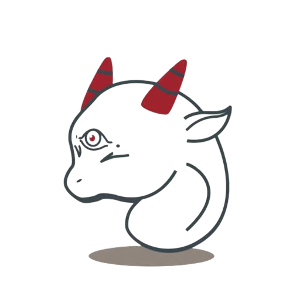

# kungze

Kungze（昆泽）意为昆仑山上的[白泽](https://baike.baidu.com/item/%E7%99%BD%E6%B3%BD/2723118)。是卓朗昆仑云团队成立的一个兴趣小组，我们的目的
是向大家分享我们在开发卓朗昆仑云的过程中创建的一些比较有意思的项目。我们在 github 上创建了一个[组织](https://github.com/kungze)开放这些项目的代码。
下面是对这些开源项目的简要介绍：

## K8S openstack 融合

k8s 能弥补 openstack 的哪些不足？

* 简化 openstack 的部署，我们第一阶段的主要工作就是打造一个通过 [helm][helm] 轻松部署 openstack 的方案
* 弥补 openstack 应用市场和 DBaaS 的不足
* 丰富 openstack 日志和监控告警的手段

openstack 能给 k8s 带来哪些好处？

* 借助 openstack cinder 提供多种后端存储
* 借助 openstack neutron 提供丰富灵活的 CNI 插件
* 借助 openstack keystone 完善 k8s 租户体系

基于以上的想法我们打算提供一些列的项目。

### kolla-helm

仓库地址：https://github.com/kungze/kolla-helm。这个项目包含一些列 helm chart，基于这些 chart 我们可以很容易的在 k8s[k8s] 平台上部署 openstack[openstack]，
在 openstack 社区有一个 [openstack-helm][openstack-helm] 项目提供了类似的功能，但是由于
openstack-helm 设计过于复杂，项目活跃度底，不兼容最新的 helm v3，所以我们打算提供一套新的 chart。
我们为什么叫 kolla-helm 呢？顾名思义，我们想要借助 [kolla][kolla] 容器来完成新版 chart 的编写。

### cinder-metal-csi

由于 k8s 官方提供的 [cinder-csi-plugin][cinder-csi-plugin] 只适用于 k8s on openstack 的场景 (即：k8s 需
要运行在 openstack 虚机里面)。所以我们打算提供一套新的 cinder csi 插件，使运行在裸金属系统上的容器也能
很方便的使用 cinder 存储。这个项目我们还在规划中，目前还没有仓库地址。

## quic-tun

仓库地址：https://github.com/kungze/quic-tun。这个项目原理上和 [kcptun](https://github.com/xtaci/kcptun) 类似，都
是把 TCP 数据包转为 UDP 数据包，借助 UDP 的特性加上一些优秀的重传算法优化流量在不稳定网络（如：网络环境有丢包）上的
传输。但是这两个项目的目的有很大区别。quic-tun 是基于 google 的 [quic](https://www.chromium.org/quic/) 协议实现
的（quic 是基于 UDP 的）。其不光有优化网络传输的功能，还有很多其他特性：

* 在服务端仅开启一个端口（需要是 UDP 端口）就可用代理多个服务端应用，在客户端可用通过 token 访问指定的应用
* 服务端可用代理本地套接字应用程序，在服务端可用把本地套接字流量转为 quic 流量，然后在客户端在转为 TCP 或者本地套接字
* 加密，quic 是强制有 ssl 加密层的，即使应用程序没有配置 ssl 证书也可用通过 quic-tun 放心的在公网上传输
* 灵活的 token 控制，可以控制特定的 client 应用程序只连接到特定的 server 应用程序。

一个典型的应用场景：在服务端有多个虚拟机打开了 VNC 或 SPICE，在正常情况下这要求服务器暴露每个虚机的 VNC/SPICE 端口，而且这些端口还是不固定的，这无疑增加了安全风险，加重了安全策略的复杂度。借助 quic-tun，服务器就只需要向外暴露一个端口即可，而且还可以放心的把这个端口暴露在公网上。

[openstack]: https://docs.openstack.org
[k8s]: https://kubernetes.io/docs/home
[helm]: https://helm.sh
[openstack-helm]: https://docs.openstack.org/openstack-helm/latest
[kolla]: https://docs.openstack.org/kolla/latest
[cinder-csi-plugin]: https://github.com/kubernetes/cloud-provider-openstack/blob/master/docs/cinder-csi-plugin/using-cinder-csi-plugin.md
