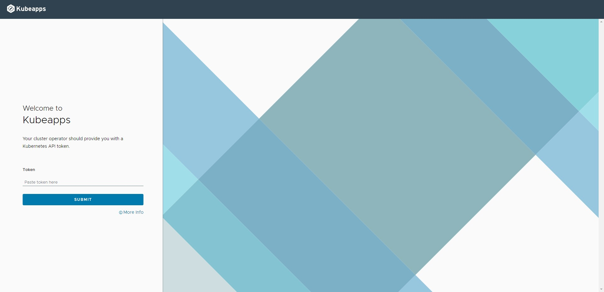
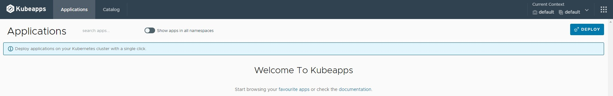
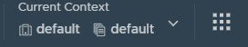
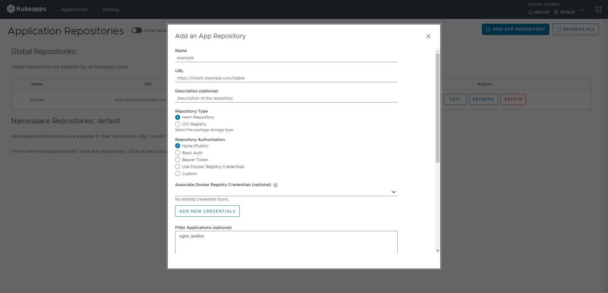
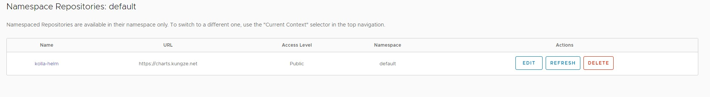
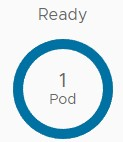

[kubeapps](https://github.com/vmware-tanzu/kubeapps) 是一个带有 web 界面的 helm chart 管理系统。

## 安装 kubeapps

```shell
helm repo add bitnami https://charts.bitnami.com/bitnami
kubectl create namespace kubeapps
helm install kubeapps --namespace kubeapps bitnami/kubeapps
```

## 创建 service 向外暴露 kubeapps dashboard

如果当前环境支持创建 loadbalancer 类型的 service 则可以用一下 manifest 文件创建 service

```yaml
apiVersion: v1
kind: Service
metadata:
  name: kubeapps-dashboard
  namespace: kubeapps
spec:
  ports:
  - name: http
    port: 80
    protocol: TCP
    targetPort: http
  selector:
    app.kubernetes.io/component: frontend
    app.kubernetes.io/instance: kubeapps
    app.kubernetes.io/name: kubeapps
  type: LoadBalancer
```

如果不支持 创建 loadbalancer 类型的 service 则我们可以通过 NodePort 类型的 service 暴露 kubeapps dashboard

```yaml
apiVersion: v1
kind: Service
metadata:
  name: kubeapps-dashboard
  namespace: kubeapps
spec:
  ports:
  - name: http
    port: 80
    protocol: TCP
    targetPort: http
  selector:
    app.kubernetes.io/component: frontend
    app.kubernetes.io/instance: kubeapps
    app.kubernetes.io/name: kubeapps
  type: NodePort
```

## 创建 serviceaccount 并绑定 admin 角色

```shell
kubectl create --namespace default serviceaccount kubeapps-operator
kubectl create clusterrolebinding kubeapps-operator --clusterrole=cluster-admin --serviceaccount=default:kubeapps-operator
cat <<EOF | kubectl apply -f -
apiVersion: v1
kind: Secret
metadata:
  name: kubeapps-operator-token
  namespace: default
  annotations:
    kubernetes.io/service-account.name: kubeapps-operator
type: kubernetes.io/service-account-token
EOF
```

获取登录 token

```shell
kubectl get --namespace default secret kubeapps-operator-token -o jsonpath='{.data.token}' -o go-template='{{.data.token | base64decode}}' && echo
```

## 登录 kubeapps dashboard

打开浏览器，输入  http://<kubeapps-dashboard service 地址>，我们可以看到如下界面：



输入上一步获取的 token，点击 `SUBMIT` 进入首页



右上角有两个 `default`，分别表示 cluster 和 namespace，点开下拉框可以切换 cluster 和 namespace。在往右有九个小方块组成的`设置`图标，点开可以添加 helm chart 仓库。



左上方的 `Applicatons` 会展示当前环境安装的所以 helm chart release，`Catalog` 列出仓库中所有的 helm chart。

## 添加仓库

点击有上方的设置按钮 -> App Repositories -> ADD APP REPOSITORY，会出现下面对话框

，其中 Name 和 URL 是必填项，其他视情况选填，以 kolla-helm 仓库为例，Name 我们可以填
写 kolla-helm，URL 填写 https://charts.kungze.net。然后点击最下方的 INSTALL REPO 按钮，我们可以看到列表中多了一个新的仓库。



点击 REFRESH 同步仓库中 chart，点击仓库名称可以看到仓库中都有哪些 chart。

## 部署 chart

点击进入我们想要部署的 chart，我们可以看到关于这个 chart 的介绍，右上角有 DEPLOY 按钮，点击进入部署页面，如果
这个 chart 包含 values.schema.json 文件则部署界面会多一个 Form 表单，通过这个表单我们可以定制部署参数，如果
没有 Form 表单我们需要直接修改 YAML 文件来修改配置参数，特别注意上方的 Name 是必填参数，修改完参数后点击下发的
DEPLOY 按钮进行部署，部署完成后会出现部署的应用的详情界面。关注上方的 pod 状态的图标



所有的 pod 都 Ready 后，这个应用就可以被正常使用了。
