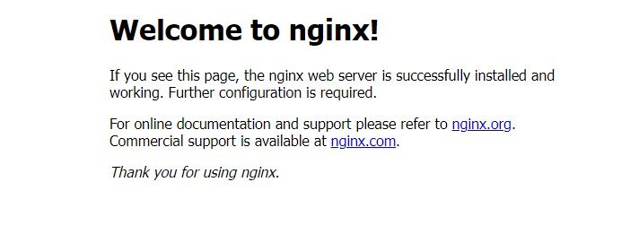

负载均衡器是一个很重要的 k8s 所依赖的基础设施组件。市场上存在的很多解决方案都是基于 IaaS 的，由 IaaS 平台提供负载均衡器功能；还有一些基于外部负载均衡器设备的的解决方案，这些方案需要购买厂商的设备。这些方案对于 k8s 开发学习人员，还是私有云 paas 平台的实施管理人员都是过重的，成本过高。[metallb](https://metallb.universe.tf/) 就是为在裸金属上部署的 k8s 平台提供一个轻量的外部负载均衡器的软件。`metallb` 支持两种模式，[BGP 模式](https://metallb.universe.tf/concepts/bgp/) 和 [layer 2 模式](https://metallb.universe.tf/concepts/layer2/)。由于 BGP 模式需要有外部路由器配合，所以我们这里介绍更为简单的 layer 2 模式。

## 安装

metallb 的安装相对来说比较简短，执行下面两个命令即可

```console
kubectl apply -f https://raw.githubusercontent.com/metallb/metallb/main/manifests/namespace.yaml
kubectl apply -f https://raw.githubusercontent.com/metallb/metallb/main/manifests/metallb.yaml
```

## 配置 layer 2 模式

**metallb 部署简单，但是存在单点故障，在生产环境建议使用 BGP 模式。**

如果 kube-proxy 使用的是 ipvs 模式，我们首先需要设置 kube-proxy 的 strictARP 为 true。

```yaml
mode: "ipvs"
ipvs:
  strictARP: true
```

下面是配置 layer 2 模式的示例文件：

```yaml
apiVersion: v1
kind: ConfigMap
metadata:
  namespace: metallb-system
  name: config
data:
  config: |
    address-pools:
    - name: my-ip-space
      protocol: layer2
      addresses:
      - 192.168.1.240/28
```

我们把上面内容保存在一个文件中，如 config-layer-2.yaml 中，然后我们执行：

```console
kubectl apply -f config-layer-2.yaml
```

metallb controller 会自动扫描这个 ConfigMap 加载配置。

特殊的，如果我们没有连续的整段 IP，我们也可以通过下面这种方式配置零散的 IP

```yaml
apiVersion: v1
kind: ConfigMap
metadata:
  namespace: metallb-system
  name: config
data:
  config: |
    address-pools:
    - name: my-ip-space
      protocol: layer2
      addresses:
      - 192.168.1.240/32
      - 192.168.1.250/32
      - 192.168.1.243/32
```

## 使用示例

使用下面的 manifest，我们创建一个 nginx deployment 和 service，service 类型是 LoadBalancer 的

```yaml
apiVersion: apps/v1
kind: Deployment
metadata:
  name: nginx
spec:
  selector:
    matchLabels:
      app: nginx
  template:
    metadata:
      labels:
        app: nginx
    spec:
      containers:
      - name: nginx
        image: nginx:1
        ports:
        - name: http
          containerPort: 80

---
apiVersion: v1
kind: Service
metadata:
  name: nginx
spec:
  ports:
  - name: http
    port: 80
    protocol: TCP
    targetPort: 80
  selector:
    app: nginx
  type: LoadBalancer
```

kubectl apply 执行成功后，执行下面命令查看创建的 service 的信息

```console
$ kubectl get svc nginx
NAME    TYPE           CLUSTER-IP      EXTERNAL-IP     PORT(S)        AGE
nginx   LoadBalancer   10.68.199.238   192.168.1.243   80:30349/TCP   2h
```

可以看到 EXTERNAL-IP 为 192.168.1.243，打开浏览器输入 <http://192.168.1.243>，可以成功访问我们刚刚部署的 nginx:


