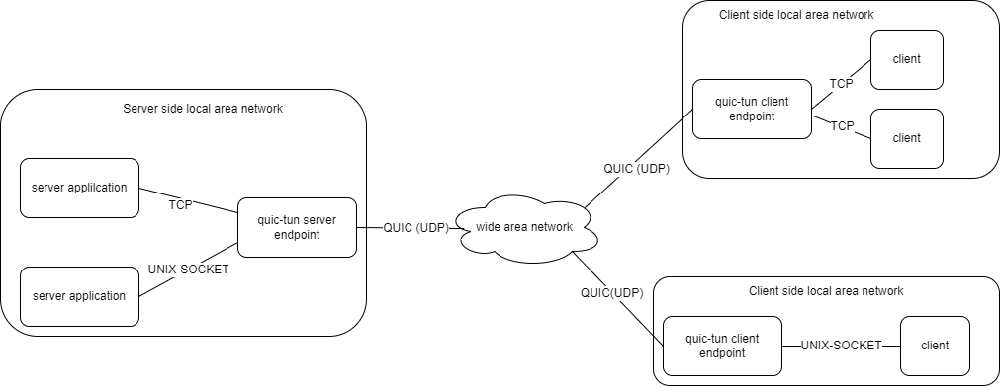

在我们内部，我们称 [quic-tun](https://github.com/kungze/quic-tun) 为弱网神器，尤其是在存在丢包现象的网络环境中，
quic-tun 能极大改善 TCP 应用的网络传输。quic-tun 项目包含两个程序，quictun-server 和 quictun-client，其核心原理
可以用一句话概述：quictun-server 把 server 端 TCP/UNIX-SOCKET 应用的传输层协议转为 [QUIC](https://www.chromium.org/quic/)，
然后 quictun-client 在把 QUIC 转为 TCP/UNIX-SOCKET，客户端应用程序只需要连接到 quictun-client 服务就可以和 server 端应用程序
交互了。

通过这种转换，quictun-server 和 quictun-client 之间的网络传输使用的是 QUIC 协议，QUIC 使用了优秀的重传算法和拥塞控制算法，能轻松
应对复杂网络环境。因此对于整体的网络状况会有极大优化。关于 quic-tun 对网络传输的优化，我们做了一些测试，并编写了[测试报告](performance-test/)，
想了解更多信息，请[点击查看](performance-test/)。

## 架构图

quic-tun 不仅有优化 TCP 传输的作用，他还能把 TCP 应用转为 UNIX-SOCKET 应用，UNIX-SOCKET 应用转为 TCP 应用，其架构图如下：



## 使用方法

调整内核参数，增大缓存区，详细原因，请参考[官方文档](https://github.com/lucas-clemente/quic-go/wiki/UDP-Receive-Buffer-Size)。
server 端和 client 端都要调整这个参数。

```console
sysctl -w net.core.rmem_max=2500000
```

打开 [release 页面](https://github.com/kungze/quic-tun/releases)，下载最新版本的 quic-tun，并解压

```console
wget https://github.com/kungze/quic-tun/releases/download/v0.0.2/quic-tun_0.0.2_linux_amd64.tar.gz
```

```console
tar xvfz quic-tun_0.0.2_linux_amd64.tar.gz
```

**注意：**`0.0.2` 是编写该文档时的最新版本。

启动 server 端程序

```console
./quictun-server --listen-on 172.18.31.36:7500
```

启动客户端程序

```console
./quictun-client --listen-on tcp:127.0.0.1:6500 --server-endpoint 172.18.31.36:7500 --token-source tcp:172.18.30.117:22 --insecure-skip-verify True
```

**注意**：上面参数 `--token-source` 指定一个 token，这个 token 用于告诉 server 端客户端应用程序想要连接到那个应用程序。后面我们会有更多关于 token 的解释。

使用 `ssh` 命令测试

```console
$ ssh root@127.0.0.1 -p 6500
root@127.0.0.1's password:
```

可以使用 `--help` 查看更多 `quictun-server` 和 `quictun-client` 支持的更多命令行参数。

## 概念解释

* **tunnel**：隧道，`quic-tun`会为每个 TCP 连接创建一个 tunnel，一个 tunnel 对应一个 QUIC 的 `connection`（quic-tun 为实现多路复用提出的一个概念）。
* **client endpoint**：隧道的 client 端点，监听在 TCP 端口或者 UNIX-SOCKET 文件，用于接受 client 应用程序的请求并与 server endpoint 建立隧道。
* **server endpoint**：隧道的 server 端点，监听在 UDP(quic) 端口，与 client endpoint 建立隧道后把隧道传输的数据转发到 server 应用。
* **token**：用于告诉 server endpoint，client 应用程序需要连接到哪个 server 应用程序，在 client endpoint 接受 client 应用程序的连接
  后第一件事就是生成 token，然后把这个 token 发送到 server endpoint，server endpoint 从这个 token 中解析出 server 应用程序的地址，然后连接到应用
  程序，在然后与 client endpoint 建立隧道。quic-tun 提供了很多 token 的获取和解析插件，想了解关于 token 更多信息，请阅读我们[专门的章节](token/)
