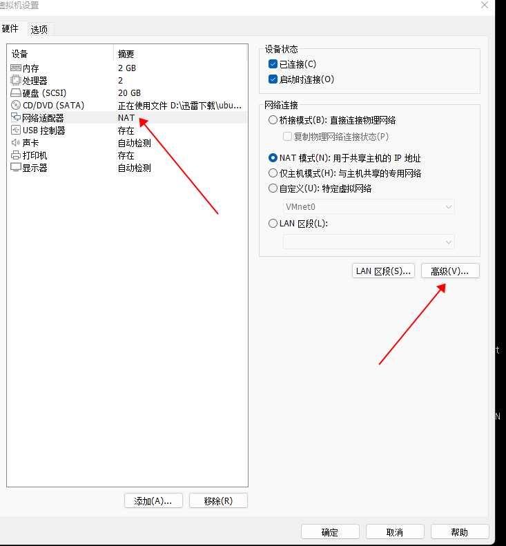
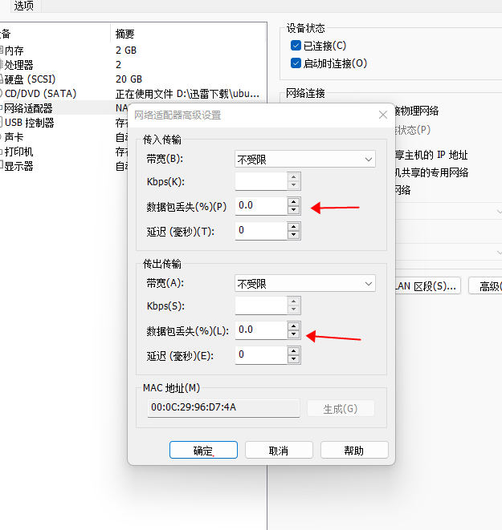

为了验证 quic-tun 对网络传输性能的影响，我们做了一些测试，并编写了这个测试报告。测试过程中我们
主要关注三个指标：传输带宽，网络延迟，CPU 使用率。在测试过程中我们构造了不同丢包率的网络环境，
然后对比不同丢包率的网络环境下：`TCP 直接传输`和`通过 quic-tun 转换之后传输`这两种情况下前面三
个指标的不同。

## 测试环境和测试工具

* 两个 VMware workstation 虚机，一个作为 server 端，一个作为 client 端，后面简称 server 或者 client
* 一个公网虚机，这个用于测试 quic-tun 在公网环境的表现。公网虚机作为 server 端，位于阿里云华东区，clien 端是一个 VMware 虚机，测试时本人位于天津
* 操作系统：ubuntu 20.02
* 带宽测试工具：iperf3
* 测试过程中使用 `top` 命令 观察 CPU 情况

对于网络延迟，我没有找到一个比较好的测试工具，因此我自己用 python 脚本编写了
一个[测试工具](https://github.com/kungze/quic-tun/tree/master/tests/latency)。

## 如何设置不同的丢包率

我们使用 VMware workstation 自带的功能来设置不同的丢包率，设置方法如下：

在测试过程中我们仅改变了 client 的丢包率，server 没有设置丢包率，并且 `传入`和`传出`丢包率设置一致。
