## 准备工作

* 在 server 虚机

  启动 iperf3 server

  ```console
  $ iperf3 -s
  -----------------------------------------------------------
  Server listening on 5201
  -----------------------------------------------------------
  ```

  打开一个新的终端，启动该 quictun-server

  ```console
  $ ./quictun-server
  I0624 09:15:29.223140    1515 server.go:30] "Server endpoint start up successful" listen address="[::]:7500"
  ```

* 在 client 虚机

  启动 quictun-server

  ```console
  $ ./quictun-client --server-endpoint 192.168.26.129:7500 --token-source tcp:127.0.0.1:5201 --insecure-skip-verify true
  I0624 09:17:30.926905    1679 client.go:35] "Client endpoint start up successful" listen address="127.0.0.1:6500"
  ```

  上面的 `192.168.26.129` 是 server  虚机的 IP 地址。

  打开一个新的终端，执行 `iperf3 -c` 开始测试

  * 直接测试 TCP 的性能

    ```console
    iperf3 -c 192.168.26.129 -p 5201 -t 20
    ```

  * 测试通过 quic-tun 转发的性能

    ```console
    iperf3 -c 127.0.0.1 -p 6500 -t 20
    ```

  打开一个新的终端，执行 `top` 命令观察 CPU 使用情况

    ```console
    top
    ```

## 测试结果

为了更清楚的展示结果，我们只记录了 client 的截屏

### 不设置丢包率（丢包率为 0.0%）

* TCP

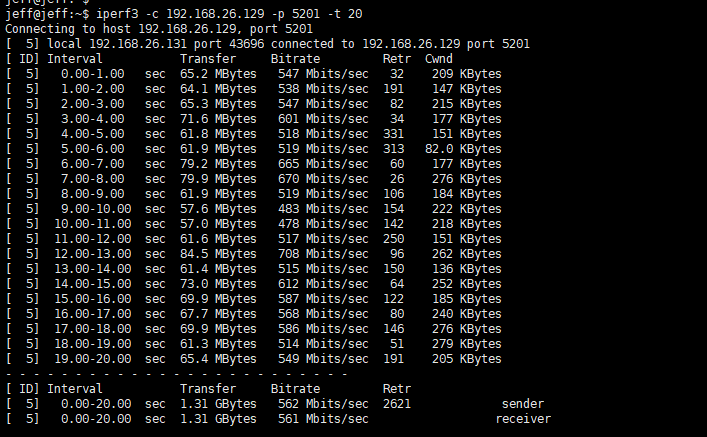
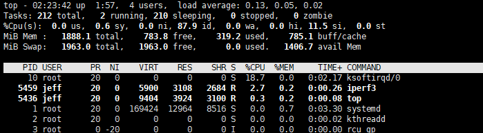

* quic-tun

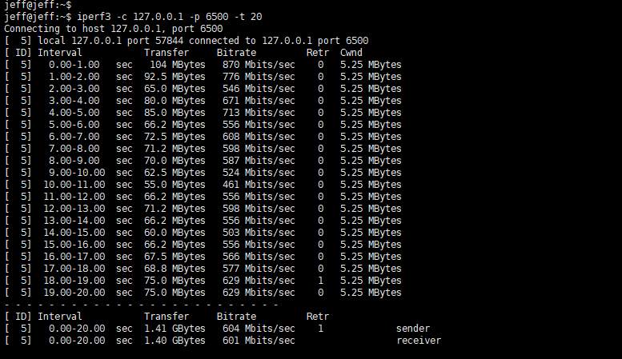
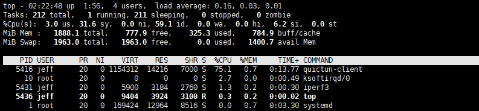

### 丢包率设置为 0.1%

* TCP

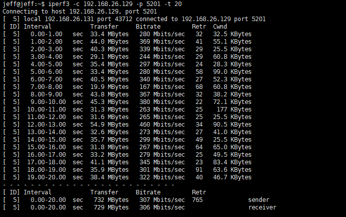
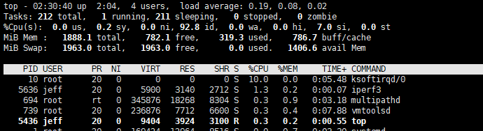

* quic-tun

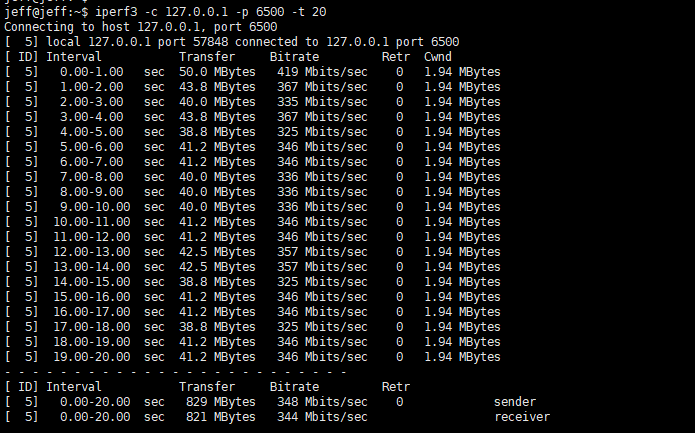
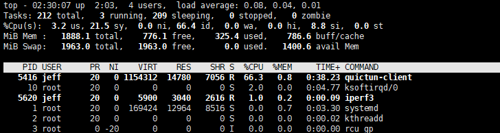

### 丢包率设置为 0.5%

* TCP

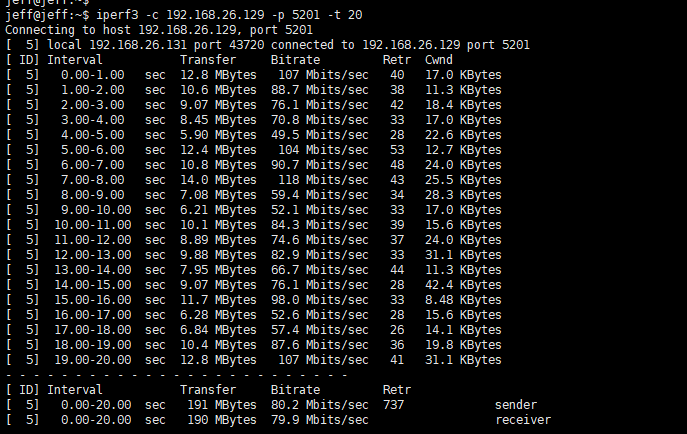
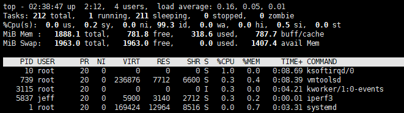

* quic-tun

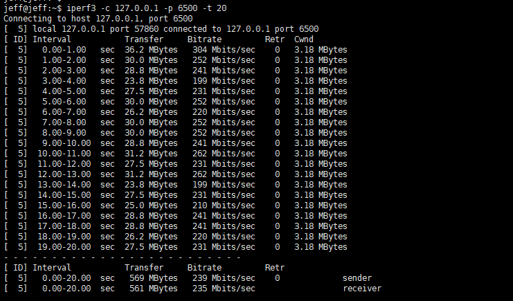
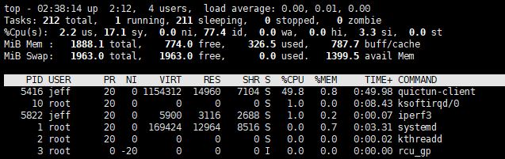

### 丢包率设置为 1.0%

* TCP

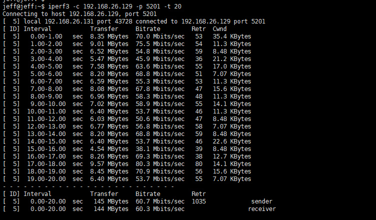
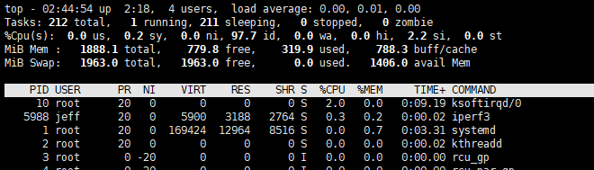

* quic-tun

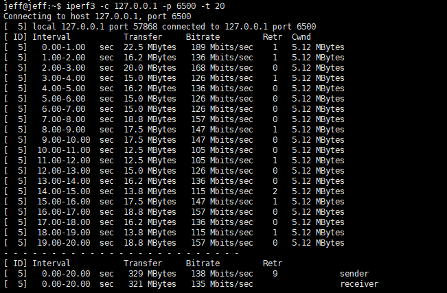
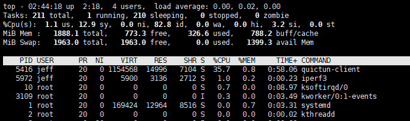

### 丢包率设置为 5.0%

* TCP

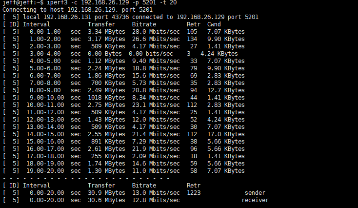
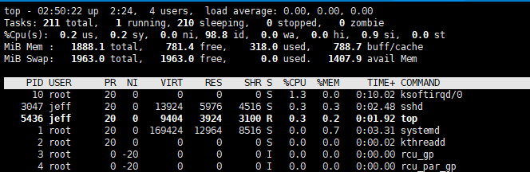

* quic-tun

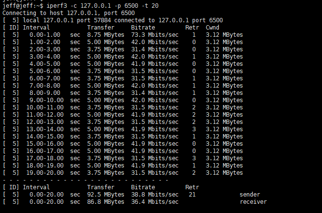
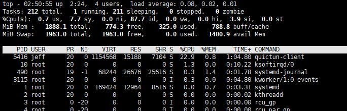

### 汇总

* TCP

|丢包率 (%)|sender bitRate(Mbits/sec)|reveiver bitRate(Mbits/sec)|CPU(ksoftirqd)|
|:------------------|:-----|:-----|:-----|
| 0  |  562 | 561 |  18.7 |
| 0.1 | 307 | 306 | 10.0 |
| 0.5 | 80.2 | 79.9 | 1.0 |
| 1 |60.7 | 60.3 | 2.0 |
| 5 |13.0 | 12.8 | 1.3 |

* quic-tun

|丢包率 (%)|sender bitRate(Mbits/sec)|reveiver bitRate(Mbits/sec)|CPU(ksoftirqd)|CPU(quictun-client)|
|:------------------|:-----|:-----|:-----|:-----|
| 0 | 604 | 601 | 2.7 | 75.1 |
| 0.1 | 348 | 344 | 2.0  | 66.3 |
| 0.5 | 239 | 235 | 1.0 | 49.8 |
| 1 | 138 | 135 | 1.0 | 35.7 |
| 5 | 38.8 | 36.4 | 1.3 | 22.9 |

从上面的测试结果我们可以看出即使没有设置丢包率，quic-tun 也能提升一定的网络带宽，在存在丢包的网络环境中，quic-tun 的表现像
比于 TCP 直接传输有了巨大的提升。但是在带宽较大的场景，quic-tun 占用了较多的 CPU（但是软中断占用的 CPU 降到了很低）

## 火焰图

为了分析为什么 quic-tun 在大带宽下占用如此多的 CPU，我们制作了 CPU 火焰图：

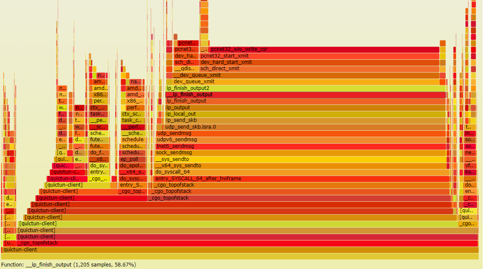

从上面的火焰图可以看出，内核空间的 `udp_sendmsg` 占用了较多的 CPU，在网上查阅文档发现下面这篇文档可以解释这种现象而且文章也给出了优化方案。

https://conferences.sigcomm.org/sigcomm/2020/files/slides/epiq/0%20QUIC%20and%20HTTP_3%20CPU%20Performance.pdf
