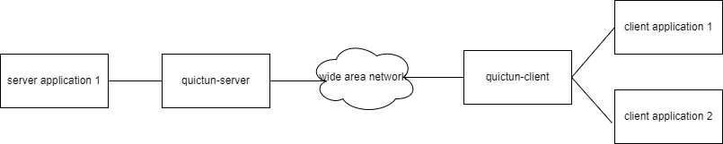
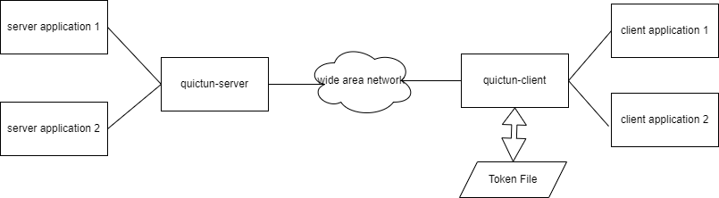

`token` 在 quic-tun 中有两个作用：1、告诉 server endpoint，准备新建的隧道需要连接的
应用程序的地址；2、用于 server endpoint 判断是否接受隧道创建请求。在 `quictun-client`我们
提供了一些 token 获取插件，在 `quictun-server` 我们提供了一些 token 的解析插件。

## Token 获取插件

token 的获取工作是在`quictun-client`中完成的，在 `quictun-client` 我们提供了两个命令行参数：`--token-source-plugin`
和 `--token-source` 用来在启动时加载指定的 token 获取插件。`--token-source-plugin` 用于指定插件名称，`--token-source` 的
参数值会作为插件初始化时的参数。目前我们支持的 token 获取插件如下：

### Fixed

固定 token，这个插件一个 `quictun-client` 只有一个 token，这也就意味着一个 `quictun-client` 服务只能
为一个固定的 server 应用程序建立隧道，也就是说所有连接到这个 `quictun-client` 服务的 client 应用程序都
会连接到一个固定的 server 服务。



示例：

```console
./quictun-client --listen-on tcp:127.0.0.1:6500 --server-endpoint 172.18.31.36:7500 --token-source-plugin Fixed --token-source tcp:172.18.30.117:22 --insecure-skip-verify True
```

**注意：**`Fixed` 是 `quictun-clint` 默认的 token source plugin，如果你不知道则默认使用这个 plugin。

### File

这个 plugin 会从一个外部文件中读取 token，文件内容格式如下：

```text
172.26.106.191 tcp:10.20.30.5:2256
172.26.106.192 tcp:10.20.30.6:3306
172.26.106.193 tcp:10.20.30.6:3306
```

文件中每行空格前面的是 client 应用程序所在机器的 IP 地址，空格后面的是 token（这里 token 是明文 token，直接展示了 server 应用程序的地址）

这种方式，当 `quictun-client` 接收 client 应用程序的连接时会首先提取 client 应用程序 的应用地址，然后从文件中读取 token，在与 `quictun-server` 建立隧道。
这种方法不同的 client 应用程序可以连接到不同的 server 应用程序。



示例：

```console
./quictun-client --insecure-skip-verify --server-endpoint 127.0.0.1:7500 --token-source-plugin File --token-source /etc/quictun/tokenfile --listen-on tcp:172.18.31.36:6622
```

这里 `--token-source` 就用于指定存放 token 的外部文件的路径。

## Token 解析插件

token 的解析是在 `quictun-server` 中完成的，`quictun-server` 的两个参数 `--token-parser-plugin` 和 `--token-parser-key` 用于指定
解析插件，及其参数。目前我们只实现了一个解析插件 `Cleartext`。

### Cleartext

根据字面意思理解这是一个明文的解析插件，也就是说 `quictun-client` 传过来的 token 没有经过加密，`quictun-server` 不解密不认证这个 token，直接使用。
这种方法在内部使用是可以的，但是在公网环境，或者 `quictun-client` 所在环境不受信的情况下这个 plugin 可能会有一些安全隐患（泄露 server 应用程序的信息）。
我们也正在计划实现一种加密 token 的解析插件。

示例：

```console
./quictun-server --listen-on 172.18.31.36:7500 --token-parser-plugin Cleartext --token-parser-key base64
```

`--token-parser-key` 指定了 token 的编码方式，上面示例中 token 使用了 base64 编码。那么 `quictun-client` 传过来的 token
必须是经过 base64 编码的：

```console
./quictun-client --listen-on tcp:127.0.0.1:6500 --server-endpoint 172.18.31.36:7500 --token-source-plugin Fixed --token-source dGNwOjE3Mi4xOC4zMC4xMTc6MjI= --insecure-skip-verify True
```

注意上面的 `--token-source` 参数 `dGNwOjE3Mi4xOC4zMC4xMTc6MjI=` 就是 `tcp:172.18.30.117:22` 经过 base64 编码之后生成的字符串。
